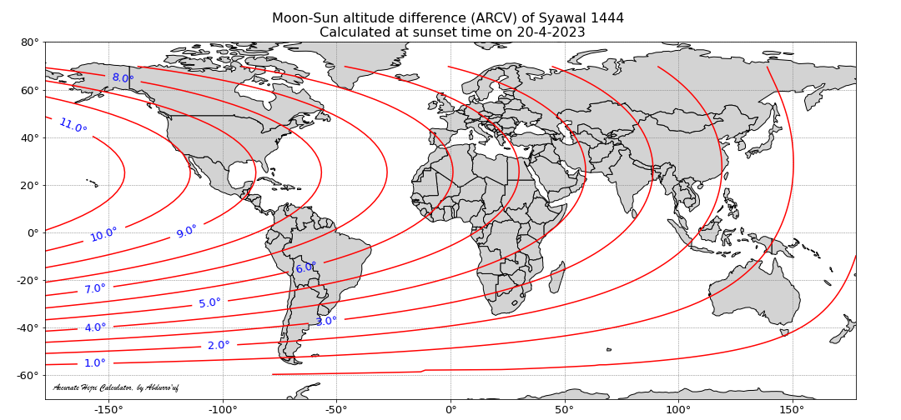
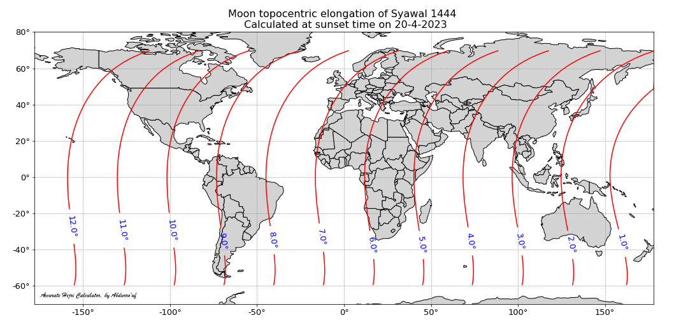
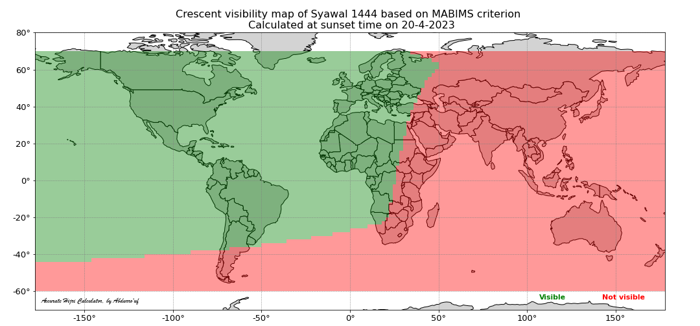
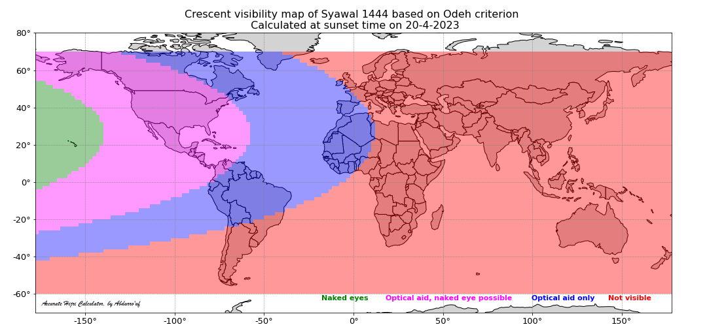
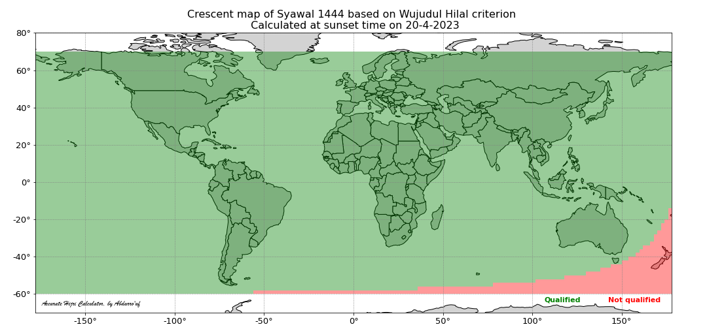
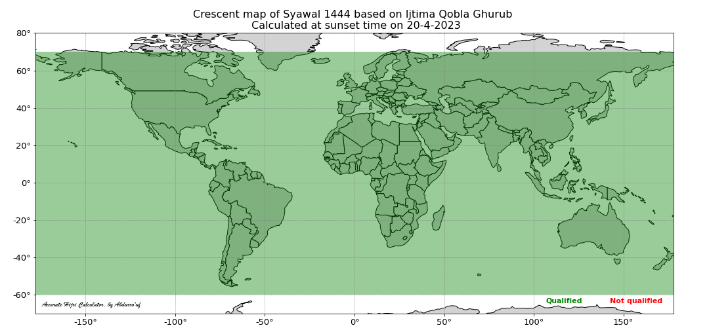

[**Kembali ke halaman depan**](./)


Accurate Hijri Calculator (AHC) adalah software yang dapat digunakan untuk menghitung posisi dan kemungkinan ketampakan hilal (kemungkinan untuk hilal berhasil dirukyat) saat waktu matahari terbenam (maghrib) setelah fase konjungsi bulan (new moon atau ijtima') telah terjadi. Hal ini digunakan sebagai patokan dalam penentuan awal bulan di kalender Hijriah. Software ini dibuat bertujuan untuk membantu umat muslim dalam memperkirakan kapan permulaan bulan hijriah, membuat kalender untuk beberapa tahun ke depan, membandingkan berbagai kriteria penentuan awal bulan hijriah, dan sebagai bahan edukasi kepada masyarakat awam tentang isu-isu terkait kalender hijriah saat ini. Software ini mengakomodasi berbagai kriteria visibilitas hilal (dalam metode hisab imkanurrukyat) yang sekarang digunakan oleh beberapa organisasi muslim di dunia. AHC pertama kami dikembangkan di tahun 2012 dan dipublikasikan di [link](https://fi.ub.ac.id/kemahasiswaan-alumni/keorganisasian/tim-astronomi-fisika/accurate-hijri-calculator-2-2/). Berbeda dengan versi partamanya yang dibuat dengan Graphical User Interface (GUI) menggunakan Delphi, sekarang AHC bertransformasi menjadi Python package yang dapat dijalankan (dipanggil) di terminal (Linux and Windows) tanpa tampilan GUI. Akan tetapi, kita bisa menjalankan AHC dengan [Jupyter notebook](https://jupyter.org/) untuk mendapatkan tampilan interaktif layaknanya GUI seperti yang dicontohkan dalam **tutorial** [berikut](https://github.com/accuhijri/ahc/blob/main/examples/ahc_1444_syawal.ipynb).     

## Download hasil perhitungan

| Year | Muharram | Shafar   | Rabiul Awwal | Rabiuts Tsani | Jumadil Ula | Jumadil Akhir | Rajab | Syaban | Ramadhan | Syawal | Dzulqadah | Dzulhijjah |
|:-----|:---------|:---------|:---------|:---------|:---------|:---------|:---------|:---------|:---------|:---------|:----------|:---------|
| 1444 | [calc](https://github.com/accuhijri/ahc_data/blob/main/data/1444/ahc_1444_muharram.ipynb),[img](https://drive.google.com/drive/folders/1zYkVQMOa3NGiazVDSOWb85z52_n_eR95?usp=share_link) | [calc](https://github.com/accuhijri/ahc_data/blob/main/data/1444/ahc_1444_shafar.ipynb),[img](https://drive.google.com/drive/folders/16I6oscehhZPpw4V4lcOJxF104SkAOcJ4?usp=share_link) | [calc](https://github.com/accuhijri/ahc_data/blob/main/data/1444/ahc_1444_rabiul_awwal.ipynb),[img](https://drive.google.com/drive/folders/19i0dPdBqMLSQSrRyTtSNgJLnKY0QxGsZ?usp=share_link) | [calc](https://github.com/accuhijri/ahc_data/blob/main/data/1444/ahc_1444_rabiuts_tsani.ipynb),[img](https://drive.google.com/drive/folders/1U6EGoq0uhBzrKN7XuJdeE9a5fk0_UxR_?usp=share_link) | [calc](https://github.com/accuhijri/ahc_data/blob/main/data/1444/ahc_1444_jumadil_ula.ipynb),[img](https://drive.google.com/drive/folders/1PE64o4rZLcGHUbV-zYpEwXU6AoRMHxd4?usp=share_link) | [calc](https://github.com/accuhijri/ahc_data/blob/main/data/1444/ahc_1444_jumadil_akhir.ipynb),[img](https://drive.google.com/drive/folders/1lqjBs2j6Jegxxb7iXdbFI1dgnlOgs8sH?usp=share_link) | [calc](https://github.com/accuhijri/ahc_data/blob/main/data/1444/ahc_1444_rajab.ipynb),[img](https://drive.google.com/drive/folders/1uzQuJuh2XWdBiQMpRbeTkDsYtyxD8FYl?usp=share_link) | [calc](https://github.com/accuhijri/ahc_data/blob/main/data/1444/ahc_1444_syaban.ipynb),[img](https://drive.google.com/drive/folders/1LQ9a_EqBWSRfcXqD70xCmOvgTMFby0f-?usp=share_link) | [calc](https://github.com/accuhijri/ahc_data/blob/main/data/1444/ahc_1444_ramadhan.ipynb),[img](https://drive.google.com/drive/folders/1BxhzrKRUY9LC-M9X8bot029Y9LBlUAY9?usp=share_link) | [calc](https://github.com/accuhijri/ahc_data/blob/main/data/1444/ahc_1444_syawal.ipynb),[img](https://drive.google.com/drive/folders/1HJVd3tzOU1wYk0vMx5KKDu1g_-K0akGi?usp=share_link) | [calc](https://github.com/accuhijri/ahc_data/blob/main/data/1444/ahc_1444_dzulqadah.ipynb),[img](https://drive.google.com/drive/folders/1Yr_DVf5f3MPekS8awHBNTM-c4V2xwJde?usp=share_link)  | [calc](https://github.com/accuhijri/ahc_data/blob/main/data/1444/ahc_1444_dzulhijjah.ipynb),[img](https://drive.google.com/drive/folders/15sPUuSIYRw3_wZZ9EeHEblyLDlbH0JPQ?usp=share_link) |
| 1445 | [calc](https://github.com/accuhijri/ahc_data/blob/main/data/1445/ahc_1445_muharram.ipynb),[img](https://drive.google.com/drive/folders/1KwxPBD79-ucOLYsONEzDOSGFW9wcYg4n?usp=share_link) | [calc](https://github.com/accuhijri/ahc_data/blob/main/data/1445/ahc_1445_shafar.ipynb),[img](https://drive.google.com/drive/folders/1X1cx5Maz18IefIcj7ppQgdZZBZC3dJxX?usp=share_link) | [calc](https://github.com/accuhijri/ahc_data/blob/main/data/1445/ahc_1445_rabiul_awwal.ipynb),[img](https://drive.google.com/drive/folders/1S9jamUTfLFEINK2vv1XRrUgiJLv0BsV2?usp=share_link) | [calc](https://github.com/accuhijri/ahc_data/blob/main/data/1445/ahc_1445_rabiuts_tsani.ipynb),[img](https://drive.google.com/drive/folders/1l0taOKxoYTIQlb-Ts0W3mSqk7bQRix1s?usp=share_link) | [calc](https://github.com/accuhijri/ahc_data/blob/main/data/1445/ahc_1445_jumadil_ula.ipynb),[img](https://drive.google.com/drive/folders/1_QhY13-3qaaVih7m_JyXNqiHjllraJc6?usp=share_link) | [calc](https://github.com/accuhijri/ahc_data/blob/main/data/1445/ahc_1445_jumadil_akhir.ipynb),[img](https://drive.google.com/drive/folders/1Y0eDvwk0Ijj1RIGwHdkFUatTwHEyApsP?usp=share_link) | [calc](https://github.com/accuhijri/ahc_data/blob/main/data/1445/ahc_1445_rajab.ipynb),[img](https://drive.google.com/drive/folders/18PXSM2pY0iX78jllS61prIZrTT2tWY73?usp=share_link) | [calc](https://github.com/accuhijri/ahc_data/blob/main/data/1445/ahc_1445_syaban.ipynb),[img](https://drive.google.com/drive/folders/1YbEHFdj3tXchRm_TFkyK1ZecC5lt4kdy?usp=share_link) | [calc](https://github.com/accuhijri/ahc_data/blob/main/data/1445/ahc_1445_ramadhan.ipynb),[img](https://drive.google.com/drive/folders/1giCQERl9YrmXAYyK04rsFUYghqAAcaBn?usp=share_link) | [calc](https://github.com/accuhijri/ahc_data/blob/main/data/1445/ahc_1445_syawal.ipynb),[img](https://drive.google.com/drive/folders/1tWnsV4FxZwLM2N7vxdvrFi0Tg3tHOt1n?usp=share_link) | [calc](https://github.com/accuhijri/ahc_data/blob/main/data/1445/ahc_1445_dzulqadah.ipynb),[img](https://drive.google.com/drive/folders/1vJ4fZvexbqFNH9Our2R4rpLFb5CssuqH?usp=share_link)  | [calc](https://github.com/accuhijri/ahc_data/blob/main/data/1445/ahc_1445_dzulhijjah.ipynb),[img](https://drive.google.com/drive/folders/1XOvbGcjH17e4K4bvOHGi4Z-BqHA8SXBp?usp=share_link) |
| 1446 | calc,[img](https://drive.google.com/drive/folders/1qe6xR2nug1vr_2B-5WAw-jPeARKDgiKZ?usp=share_link) | calc,[img](https://drive.google.com/drive/folders/1QdnfBXwE3V1WvCG7_HY1akOslaNNANsP?usp=share_link) | calc,[img](https://drive.google.com/drive/folders/1SO4uZeRSeyY-zaEga6Sud8CSPM5wYiB7?usp=share_link) | calc,[img](https://drive.google.com/drive/folders/1kJtwROuzBHTx6DHy1SnckgaOt-jCkFZq?usp=share_link) | calc,[img](https://drive.google.com/drive/folders/1k5FroXIdFLAoNRmQHigq6fFPf9Up0sse?usp=share_link) | calc,[img](https://drive.google.com/drive/folders/1HM-jYGALF1obJiLAJEfyTtU1oajPIVDp?usp=share_link) | calc,[img](https://drive.google.com/drive/folders/1GsOKssvGCY_zqM3og-7L47MZuXDOL2BD?usp=share_link) | calc,[img](https://drive.google.com/drive/folders/1xRpDdRU4C2f6Nx-VHfhKQl9nDpMT2lWZ?usp=share_link) | calc,[img](https://drive.google.com/drive/folders/1Tok9S7o2D61zZEsExZBTOMsMQyXjdF7V?usp=share_link) | calc,[img](https://drive.google.com/drive/folders/1KI6jMGy352zG2hedCKzksTmJ4XDYHvL6?usp=share_link) | calc,[img](https://drive.google.com/drive/folders/1MZY9EOiXljwjt8ElrTQanUlmVgPyxPRE?usp=share_link)  | calc,[img](https://drive.google.com/drive/folders/1_v_yWDoP0phN7Ci5bvdDzDkzZAJxu7KJ?usp=share_link) |
| 1447 | calc,[img](https://drive.google.com/drive/folders/1fP0fDUBz5WuUUVDpA6S4c6cy4yl_Y3P6?usp=share_link) | calc,[img](https://drive.google.com/drive/folders/1rmbHkqze8ZdQO17-_eDipVHKLZRn6gvC?usp=share_link) | calc,[img](https://drive.google.com/drive/folders/12BPW7R3WX0LuzGDRMZuI40j-wUR4xewm?usp=share_link) | calc,[img](https://drive.google.com/drive/folders/1wsHhzdKB43-WzG84rbd_2TDYIQBlt2Oz?usp=share_link) | calc,[img](https://drive.google.com/drive/folders/1LE0pg7exJ3nLVK0ztUlYN86OsoZGJqck?usp=share_link) | calc,[img](https://drive.google.com/drive/folders/1kN-NckYxFd1cqtJNLNBfiulw-Ocv6kB9?usp=share_link) | calc,[img](https://drive.google.com/drive/folders/14xe9Xalyr6ITUySCJllyK3cEfEvqUNDl?usp=share_link) | calc,[img](https://drive.google.com/drive/folders/1qDI0pTxTxfaXBHNc-YYSwCnFAhGgrSbu?usp=share_link) | calc,[img](https://drive.google.com/drive/folders/1njfM6M6_wDvlFpJ8VDBLUkQB4DunFP7S?usp=share_link) | calc,[img](https://drive.google.com/drive/folders/1xRBTMPPkcD-EGjnKgz1ezR0BNDkU4T0g?usp=share_link) | calc,[img](https://drive.google.com/drive/folders/11yaWHoQ_3uEweFK_BRMvYGYfHtY1WvVg?usp=share_link)  | calc,[img](https://drive.google.com/drive/folders/1HQXCBKrQgNGQE66n9VB0ObsS0yx9HTcG?usp=share_link) |
| 1448 | calc,[img](https://drive.google.com/drive/folders/1p7B_ZVePoDY0qSPw647xX5DC2g9lH7ZT?usp=share_link) | calc,[img](https://drive.google.com/drive/folders/1EuAkE_9LBUaWHSIOgrY1Nlb3cvnlSK3k?usp=share_link) | calc,[img](https://drive.google.com/drive/folders/1dnaK5o-VXdzYbgQBlyjVbtIaYOFn6ZH1?usp=share_link) | calc,[img](https://drive.google.com/drive/folders/1orgKpZpeKAEGZUOQ6vqtZNbrnGpOSZZ8?usp=share_link) | calc,[img](https://drive.google.com/drive/folders/1xSjQ2xz-w18XimuSwi69yZXYH9MUOtOQ?usp=share_link) | calc,[img](https://drive.google.com/drive/folders/1CPZe_xb3Be40w3O86SMBiNR09y8bMdZC?usp=share_link) | calc,[img](https://drive.google.com/drive/folders/1m3Oay5ey4T5MDWiHHKhZfcrJcFNMWZFD?usp=share_link) | calc,[img](https://drive.google.com/drive/folders/1TY10DpOUGjhpqLSlmdwjfWjfwiR9dH1m?usp=share_link) | calc,[img](https://drive.google.com/drive/folders/1hl982QE_QyrNPYBHjGwNzbCSc9aomtcT?usp=share_link) | calc,[img](https://drive.google.com/drive/folders/1tFAPXkSUcSR-thX9ofloFLokgPizDElT?usp=share_link) | calc,[img](https://drive.google.com/drive/folders/1OtmnpLI1a_u19uENjLE43S3XhpceDlQz?usp=share_link)  | calc,[img](https://drive.google.com/drive/folders/1SoOLpI6ZqjEwsULbgvU9E1lL-fRvwa4y?usp=share_link) |
| 1449 | calc,[img](https://drive.google.com/drive/folders/1LXJrEN0ZWNYiABkUGIVix4CItIR-gi76?usp=share_link) | calc,[img](https://drive.google.com/drive/folders/1DLS6U4Z3Wmxra6HPJUQUceg2-p1SrMDy?usp=share_link) | calc,[img](https://drive.google.com/drive/folders/1CwG2_k9QL41mY9BE9F3xTTz_-dWt14Bu?usp=share_link) | calc,[img](https://drive.google.com/drive/folders/1TF3Pgj11lH9lFA1H5_22KQ3t-KJ8Fxcm?usp=share_link) | calc,[img](https://drive.google.com/drive/folders/1zse9kDs3_z6CydkJRVaJr5sJr-oP1JL8?usp=share_link) | calc,[img](https://drive.google.com/drive/folders/1JrqNFvZtMuuDODRlr-iSp2CbSBIgqCEY?usp=share_link) | calc,[img](https://drive.google.com/drive/folders/1KvNqgXfUdr476fhMSVioo_OVD62HuJF6?usp=share_link) | calc,[img](https://drive.google.com/drive/folders/1rTdrudZpfblFL6IMPAZU3aDdRlcnfoAP?usp=share_link) | calc,[img](https://drive.google.com/drive/folders/1Nwt4pOIVFWuqqFLzMBXs9usxZEQJ_Za3?usp=share_link) | calc,[img](https://drive.google.com/drive/folders/1SP9r_stLnSjPnvi1wMUMUwVffP2s2fdk?usp=share_link) | calc,[img](https://drive.google.com/drive/folders/19N_d9jX831FOC3DoKsVMp7xvQzm2HmvH?usp=share_link)  | calc,[img](https://drive.google.com/drive/folders/1L5OebjIrE5U33aAzQkUV3YfS6byJl1EA?usp=share_link) |
| 1450 | calc,[img](https://drive.google.com/drive/folders/1I1fKhWP_BgX17Pw3dJwiJTJzCY4fIM7G?usp=share_link) | calc,[img](https://drive.google.com/drive/folders/1fdeLi73CiWrA3xtF_GPUAB5QrXcxjSux?usp=share_link) | calc,[img](https://drive.google.com/drive/folders/12cAIRk3QyP8tlhlfeZz_IMlfp3Zp-Q68?usp=share_link) | calc,[img](https://drive.google.com/drive/folders/11h2mmx7wwuNP0RrgKYlDB44ss7tsFJYJ?usp=share_link) | calc,[img](https://drive.google.com/drive/folders/1Jnz5yY8ZuUoJPFSYR8CJDRw7EQC7LfWX?usp=share_link) | calc,[img](https://drive.google.com/drive/folders/1gELLnmBsDjJxLIbPDiVzm00f4FEIM-su?usp=share_link) | calc,[img](https://drive.google.com/drive/folders/1XL7GAEeN5wzGPr3ORv2nT9fHhs5IKs_t?usp=share_link) | calc,[img](https://drive.google.com/drive/folders/12McL04rfU6Mesq1Q0d1E5oa401ILtGe6?usp=share_link) | calc,[img](https://drive.google.com/drive/folders/10xONpEwhijl7i_6zugEXa6byyOq98joC?usp=share_link) | calc,[img](https://drive.google.com/drive/folders/15Zg0eXOpbIS2EYN_xVG1Ae_4tD9V04e4?usp=share_link) | calc,[img](https://drive.google.com/drive/folders/1YytO0JD-mD1xszmOy6yiAjuB-IrM28wO?usp=share_link)  | calc,[img](https://drive.google.com/drive/folders/1lwDPgLJ8qM68JS6b4EB1yK8qnhLO54nQ?usp=share_link) |
| 1451 | calc,[img](https://drive.google.com/drive/folders/1qx3hUBeDOTnO8MxCaQcVVkfHzywFvVQS?usp=share_link) | calc,[img](https://drive.google.com/drive/folders/14Fj9Ff__zAjqQgv8-FvGK79MipaTMdiQ?usp=share_link) | calc,[img](https://drive.google.com/drive/folders/1pKZjnL36VlYsJLQqncbGKCzEHtSsyMdA?usp=share_link) | calc,[img](https://drive.google.com/drive/folders/19vTCWd3qLtF2xKvAZIJDFfMcKDxMnqz5?usp=share_link) | calc,[img](https://drive.google.com/drive/folders/1xAQW-P4CW6V9qZbb6SbuY72cxpb8FpW5?usp=share_link) | calc,[img](https://drive.google.com/drive/folders/1DN6Xp8LNTnSD3Ocw2q1AgDHgv8LOq1lZ?usp=share_link) | calc,[img](https://drive.google.com/drive/folders/1sS5-gW77KHaCku7SgRo58oTngwsGoW1K?usp=share_link) | calc,[img](https://drive.google.com/drive/folders/1B0DBgy9YBwc23799Ma2E9FLm1imcNygb?usp=share_link) | calc,[img](https://drive.google.com/drive/folders/1euytl_vbtB90eh28UwiVzpeCeScsaoem?usp=share_link) | calc,[img](https://drive.google.com/drive/folders/1vc0P-fwsyn-b1_7Zi_J-W0wepCiiT9fj?usp=share_link) | calc,[img](https://drive.google.com/drive/folders/17rzEDJb_SgHYPliqBIGGo0IX7_2xhe4y?usp=share_link)  | calc,[img](https://drive.google.com/drive/folders/1C-dPvV3UyI1r64gqoasVuhKHZOVwBPI9?usp=share_link) |
| 1452 | calc,[img](https://drive.google.com/drive/folders/1Pjzs0jpL3qMnRJnz-oF0BO5PGWYwx1d6?usp=share_link) | calc,[img](https://drive.google.com/drive/folders/1OlPAXpV3xspcn0yDLXW58dNSLh2CaVuS?usp=share_link) | calc,[img](https://drive.google.com/drive/folders/1NF4h5ogOEafpBfq7CYRbOdU1FEZGSYrg?usp=share_link) | calc,[img](https://drive.google.com/drive/folders/1mRG4K-ss0C5C439IPdWckVBIuMRFMVz9?usp=share_link) | calc,[img](https://drive.google.com/drive/folders/1mI2qF7_iSEa37AOIP0zP6Wl_4KZLHVYK?usp=share_link) | calc,[img](https://drive.google.com/drive/folders/1-tOI-YowSoTVJ4KYO41xF9bz8Z5rIxvh?usp=share_link) | calc,[img](https://drive.google.com/drive/folders/12DACOr1r3FeYmsT1XUHMe7F4pF3x4lyd?usp=share_link) | calc,[img](https://drive.google.com/drive/folders/1rcdAUauD0KKVdy-mtLccNnGApldbpBV0?usp=share_link) | calc,[img](https://drive.google.com/drive/folders/1agY_JF2Hx51PjCYQAPlpyVdcC55NAezP?usp=share_link) | calc,[img](https://drive.google.com/drive/folders/1FRlMC5WLqI2ZpznbySElFfeS912fbJAK?usp=share_link) | calc,[img](https://drive.google.com/drive/folders/1mf6d7fc_AwWI6c54dIUwqK8UdiMioEBQ?usp=share_link)  | calc,[img](https://drive.google.com/drive/folders/1l06IvuY3jkYO5GDPccFT5c-3RCP8Mbal?usp=share_link) |
| 1453 | calc,[img](https://drive.google.com/drive/folders/1E-v_IAhuSNxQWlGPMNu2ud6zl5vKU0Je?usp=share_link) | calc,[img](https://drive.google.com/drive/folders/1XT9vG9aohKLAn0WVRPuEEqpBysQUw6IJ?usp=share_link) | calc,[img](https://drive.google.com/drive/folders/1Dxf7FbxCvCLisKeeI9QOEIL_iM_-F15h?usp=share_link) | calc,[img](https://drive.google.com/drive/folders/1ClA3d_cooE_IXlPSyxiw-LtteRGmKfH3?usp=share_link) | calc,[img](https://drive.google.com/drive/folders/1vs10H-FqseyNTuysC21kCSTt22nld9V5?usp=share_link) | calc,[img](https://drive.google.com/drive/folders/1qqIn78FpE_Q-BBQfIHzbExlrV0188VjZ?usp=share_link) | calc,[img](https://drive.google.com/drive/folders/12EqeWG_ySenb66NN1w4zwnNojz7_h2Nr?usp=share_link) | calc,[img](https://drive.google.com/drive/folders/1Q_S7pc3qp-aX8QdYGFuLAOV2df6Be7sQ?usp=share_link) | calc,[img](https://drive.google.com/drive/folders/1W7Q-b7r3tsBe19K3lMuWgc39J-unvl6r?usp=share_link) | calc,[img](https://drive.google.com/drive/folders/1ZkOlWtPs8knpDmSntHohzdRLfXD0Iubt?usp=share_link) | calc,[img](https://drive.google.com/drive/folders/1SIG3SVkIugrrEm3g00Pfms6foHXPrUHV?usp=share_link)  | calc,[img](https://drive.google.com/drive/folders/1S2Kza-8cdp6jfxTlCX0BD-3zpvPvaJdG?usp=share_link) |
| 1454 | calc,[img](https://drive.google.com/drive/folders/1oP4BqkNDriDC2KYv73-6lSHmMhuCA4BR?usp=share_link) | calc,[img](https://drive.google.com/drive/folders/1wPMWOU8GBcI_mHOuTS59K_Rbp7jJSZqw?usp=share_link) | calc,[img](https://drive.google.com/drive/folders/1ZCw39WhTF0vGJBA1_Nyw0sh238RJIYfv?usp=share_link) | calc,[img](https://drive.google.com/drive/folders/1XcwM1rkirT3FcBpMUyf6L1qi9Df6IMIJ?usp=share_link) | calc,[img](https://drive.google.com/drive/folders/15TTi2J7KmciI4ihybc3HUuvJnbvmRYPl?usp=share_link) | calc,[img](https://drive.google.com/drive/folders/1t_G_NS25vjOgdgZ05bFXshKivvXNa82Y?usp=share_link) | calc,[img](https://drive.google.com/drive/folders/1mkKisnSfr-wIgSmi7ME7tPYenVBJB7wh?usp=share_link) | calc,[img](https://drive.google.com/drive/folders/1oc5X0thtd2_kevGpCu8S3Vjh_LABtow0?usp=share_link) | calc,[img](https://drive.google.com/drive/folders/1RinyigVARWae9GRsYS-VoHTBZkvoO88g?usp=share_link) | calc,[img](https://drive.google.com/drive/folders/1vkg_t6TFn4TcXZfUXTHZvWZRap8I6f_Z?usp=share_link) | calc,[img](https://drive.google.com/drive/folders/19GtJfguhdlob1WX1IyiQW5kUnzm58_Fs?usp=share_link)  | calc,[img](https://drive.google.com/drive/folders/1U3E5UMiNWJ--gfBZYFsHgekaye7iaO3q?usp=share_link) |

## Developer 

Software ini dikembangkan oleh [Abdurro'uf](https://aabdurrouf.github.io/), seorang astronom indonesia yang sekarang bekerja sebagai peneliti di Department of Physics and Astronomy, The Johns Hopkins University and The Space Telescope Science Institute (STScI). Saran, pertanyaan, atau laporan bugs dapat dikirimkan melalui email ke abdurroufastro@gmail.com or fabdurr1@jhu.edu. 
 
## Installation

Untuk menginstall AHC, pertama clone AHC package ke folder (directory) yang anda inginkan (di laptop/komputer). Setelah itu masuk ke folder `ahc` dan lakukan penginstallan. Anda bisa melakukanya dengan mengikuti commands berikut.

```
git clone https://github.com/accuhijri/ahc.git
cd ahc
python -m pip install .
```

Untuk dapat menggunakan AHC, anda perlu menempatkan file `de421.bsp` di directory tempat anda bekerja. File ini sudah termasuk dalam `ahc` package dan dapat dicopy ke directory tersebut. Alternatif lain bisa mendownload file tersebut langsung dari website NASA dengan menggunakan command berikut. 

```
wget https://ssd.jpl.nasa.gov/ftp/eph/planets/bsp/de421.bsp
```

Terakhir, anda perlu menginstall [geopandas](https://geopandas.org/en/stable/) jika ingin membuat peta vibilitas hilal menggunakan AHC. Untuk menginstalnya, anda bisa menggunakan command berikut, dengan asumsi anda telah mempunyai `conda` terinstal di komputer.  

```
conda install -c conda-forge geopandas
```

## Beberapa fitur

### 1. Calculate the data of hilal (i.e., crescent)

Di contoh ini, kita akan mencoba memperkirakan kapan awal bulan Syawal 1444 hijriah dengan menggunakan beberapa kriteria yang diadopsi oleh beberapa organisasi islam di seluruh dunia. Pada dasarnya untuk memperkirakan awal bulan hijriah kita perlu tahu posisi bulan terhadap horizon (ufuk) saat waktu matahari terbenam (maghrib) setelah terjadinya konjungsi (ijtima').

Pertama-tama, kita memanggil class `hilal`.

```ruby
from ahc.hilal import hilal

# input the hijri year and month. 
# since we want to get crescent (i.e., hilal) visibility maps later, so we set calculate_maps=True
# plus_1day input agrument indicates that we want to also calculate the visibility maps for 1 day after the conjunction (i.e., new moon phase)

hijri_year = 1444
hijri_month = 10        # syawal is 10th month in Hijri calendar
calculate_maps = True 
plus_1day = True
hl = hilal(hijri_year=hijri_year, hijri_month=hijri_month, calculate_maps=calculate_maps, plus_1day=plus_1day)
```

Kemudian kita bisa menngunakan fungsi `calculate_hilal_data` untuk mendapatkan data hilal waktu maghrib di hari terjadinya konjungsi (lokal). Kita juga bisa menghitung data hilal untuk hari-hari berikutnya dengan mengatur masukan `delta_day` pada fungsi tersebut. Untuk menggunakan fungsi ini kita perlu memasukkan koordinat lokasi dan time-zone. Daftar time-zone yang diterima oleh AHC dapat dilihat di [sini](https://github.com/accuhijri/ahc/blob/main/ahc/timezones.txt).

```ruby
# location and time-zone
latitude = 3.595196
longitude = 98.672223
elevation = 23.0
time_zone_str = 'Asia/Jakarta'
loc_name = 'INDONESIA Medan'
hl.calculate_hilal_data(latitude, longitude, elevation, time_zone_str, loc_name=loc_name, delta_day=0)
```


### 2. Mendapatkan peta posisi bulan 

Selain mendapatkan data hilal, kita juga bisa mendapatkan peta posisi bulan saat maghrib, yang meliputi peta ketinggian bulan, elongasi (geocentris dan topocentris), perbedaan tinggi bulan dan matahari (arc of vision; ARCV), ketebalan cahaya bulan, dan umur bulan sejak konjungsi dalam UTC. Berikut ini adalah command untuk mendapatkan peta ketinggian bulan.

```ruby
hl.map_moon_altitude()
```


Mendapatkan peta ARCV (beda tinggi bulan dan matahari)

```ruby
hl.map_moon_sun_altitude_difference()
```


Mendapatkan peta elongasi topocentris 

```ruby
hl.map_moon_elongation()
```


Mendapatkan peta elongasi geocentris

```ruby
hl.map_moon_geocentric_elongation()
```


Mendapatkan peta ketebalan cahaya bulan

```ruby
hl.map_moon_width()
```


Dan mendapatkan peta umur bulan dalam UTC.

```ruby
hl.map_moon_age_utc_localsunset()
```


### 3. Medapatakan peta visibilitas hilal berdasarkan berbagai kriteria

Ada enam kriteria yang saat ini tersedia di AHC: MABIMS, Odeh, Wujudul Hilal, Turkey, Danjon, and Itjima Qobla Ghurub. Daftar kriteria ini dapat dilihat dengan memanggil fungsi `list_hilal_visibility_criteria`. Sebenernya tidak semua kriteri tersebut adalah kriteria visibilitas hilal (imkanurrukyat). Kriteria Wujudul Hilal and Ijtima Qobla Ghurub tidak diperuntukkan untuk memprediksikan ketampakan hilal. Kriteria Wujudul Hilal saat ini digunakan oleh PP Muhammadiyah di Indonesia untuk menghitung kalender Hijriah.  

#### 3.1. Peta ketampakan hilal berdasarkan kriteria MABIMS

Kriteria ini saat ini digunakan oleh pemerintah (Kementerian Agama) Indonesia, Malaysia, Singapura, dan Brunei Darussalam. Berdasarkan kriteria ini, hilal dapat teramati jika ketinggianya melebihi 3 derajat dan elongasi geocentris nya melebihi 6.4 derajat.

```ruby
hl.map_hilal_visibility('MABIMS')
```


#### 3.2. Crescent visibility map based on Odeh criterion

Kriteria ini diusulkan oleh Mohammad Odeh dalan paper beliau [Odeh et al. (2016)](https://link.springer.com/article/10.1007/s10686-005-9002-5) yang dipublikasikan oleh Journal of Experimantal Astronomy. Kriteria ini disusun berdasarkan data observasi sebanyak 737 dan menggunakan parameter ketebalan cahaya bulan (yang setara dengan elongasi) dan beda tinggi bulan dan matahari (ARCV).

```ruby 
hl.map_hilal_visibility('Odeh')
```


#### 3.3. Crescent visibility map based on Terkey criterion

Kriteria ini diusulkan dalam International Hijri Calendar Union Congress in Istanbul in 2016 ([news](https://www.dailysabah.com/turkey/2016/05/31/islamic-scholars-agree-on-a-shared-lunar-calendar-for-muslim-world)) untuk digunakan sebagai kriteria tunggal penanggalan hijriah global. Deskripsi lengkap kriteria ini dapat dilihat di [sini](https://github.com/accuhijri/accuhijri.github.io/blob/main/figures/turkey_criterion.png). Pada dasarnya, kriteria ini dibentuk dari kriteria visibilitas hilal dengan tambahan dua syarat (kondisi). Kriteria visibilitas hilalnya adalah tinggi hilal minimal 5 derajat dan elongasi topocentris minimal 8 derajat. Dua syarat tambahannya adalah: (1) kondisi hilal untuk dapat dilihat (berdasarkan rumus di atas) harus terjadi di suatu tempat di bumi dimana waktu sunset lokal lebih awal dibandingkan dengan waktu tegah malam (perhantian hari kalender Masehi) 00:000 GMT.; dan (2) konjungsi terjadi sebelum waktu fajar di Selandia Baru.    

```ruby
hl.map_hilal_visibility('Turkey')
```


#### 3.4. Crescent visibility map based on Danjon limit

Berdasarkan kriteria ini, hilal dapat dilihat jika elongasinya melebihi 7 derajat.

```ruby
hl.map_hilal_visibility('Danjon')
```


#### 3.5. Cresecent map based on Wujudul Hilal criterion

Berdasarkan kriteria ini, bulan baru dapat dimulai jika konjungsi telah terjadi dan bulan terbenam setelah matahari terbenam.

```ruby
hl.map_hilal_visibility('Wujudul Hilal')

```


#### 3.6. Map of Ijtima Qobla Ghurub

Berdasarkan kriteria ini, bulan baru dapat dimulai (setelah maghrib) jika konjungsi terjadi sebelum matahari terbenam.
```ruby
hl.map_hilal_visibility('Ijtima Qobla Ghurub')
```

