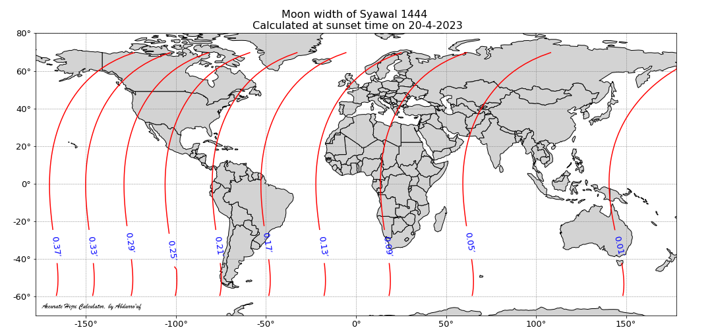
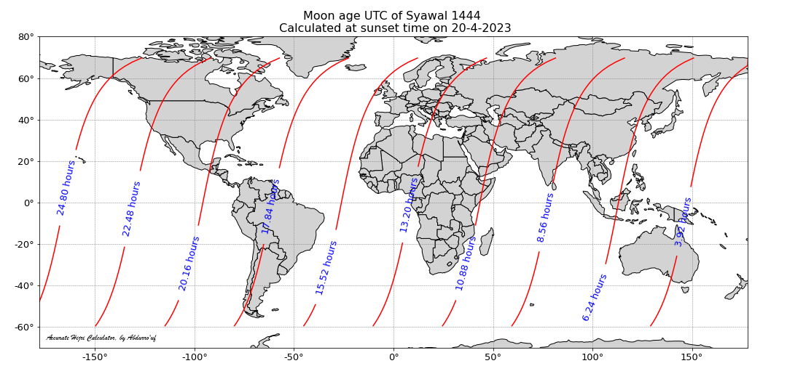
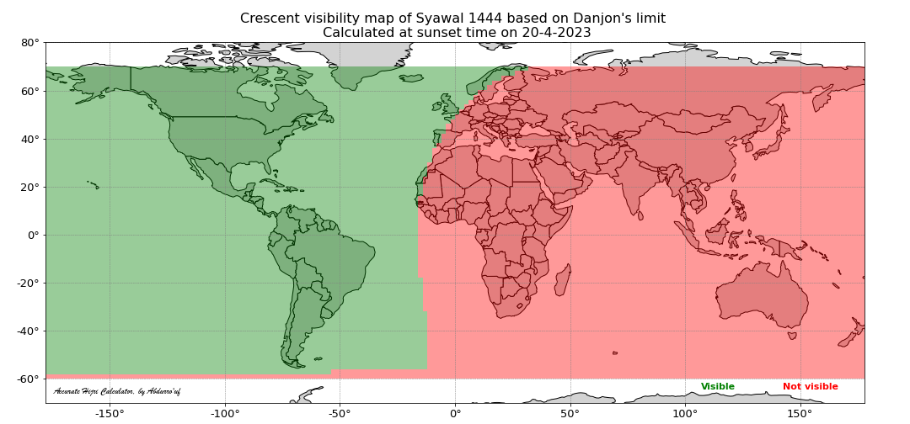

[**Halaman berbahasa Indonesia**](./another-page.html)

Accurate Hijri Calculator (AHC) is a software for calculating the position and visibility of the crescent moon at the sunset time after the conjunction (ijtima'/new moon phase) that marks the beginning of a new month in the Islamic lunar calendar (Hijri calendar). This tool is intended for helping moslem people in estimating the start of a new Hijri month, making a calendar for coming years, comparing among the criteria of Hijri calendar, as well as educating people about the current issues regarding the Hijri calendar. This software incorporates various crescent visibility criteria (in the Hisab Imkanurrukyat methodology) currently adopted by moslem organizations around the world. AHC was firt developed in 2012 and was published at [link](https://fi.ub.ac.id/kemahasiswaan-alumni/keorganisasian/tim-astronomi-fisika/accurate-hijri-calculator-2-2/). While the first version of AHC was built with Graphical User Interface (GUI) support from Delphi, now it is transformed into fully Python package and can be executed on terminal (Linux and Windows) without GUI display. One can run AHC on [Jupyter notebook](https://jupyter.org/) to get GUI experience as demonstrated in a **tutorial** [here](https://github.com/accuhijri/ahc/blob/main/examples/ahc_1444_syawal.ipynb). 

## Download results

| Year | Muharram | Shafar   | Rabiul Awwal | Rabiuts Tsani | Jumadil Ula | Jumadil Akhir | Rajab | Syaban | Ramadhan | Syawal | Dzulqadah | Dzulhijjah |
|:-----|:---------|:---------|:---------|:---------|:---------|:---------|:---------|:---------|:---------|:---------|:----------|:---------|
| 1444 | [calc](https://github.com/accuhijri/ahc_data/blob/main/data/1444/ahc_1444_muharram.ipynb),[img](https://drive.google.com/drive/folders/1zYkVQMOa3NGiazVDSOWb85z52_n_eR95?usp=share_link) | [calc](https://github.com/accuhijri/ahc_data/blob/main/data/1444/ahc_1444_shafar.ipynb),[img](https://drive.google.com/drive/folders/16I6oscehhZPpw4V4lcOJxF104SkAOcJ4?usp=share_link) | [calc](https://github.com/accuhijri/ahc_data/blob/main/data/1444/ahc_1444_rabiul_awwal.ipynb),[img](https://drive.google.com/drive/folders/19i0dPdBqMLSQSrRyTtSNgJLnKY0QxGsZ?usp=share_link) | [calc](https://github.com/accuhijri/ahc_data/blob/main/data/1444/ahc_1444_rabiuts_tsani.ipynb),[img](https://drive.google.com/drive/folders/1U6EGoq0uhBzrKN7XuJdeE9a5fk0_UxR_?usp=share_link) | [calc](https://github.com/accuhijri/ahc_data/blob/main/data/1444/ahc_1444_jumadil_ula.ipynb),[img](https://drive.google.com/drive/folders/1PE64o4rZLcGHUbV-zYpEwXU6AoRMHxd4?usp=share_link) | [calc](https://github.com/accuhijri/ahc_data/blob/main/data/1444/ahc_1444_jumadil_akhir.ipynb),[img](https://drive.google.com/drive/folders/1lqjBs2j6Jegxxb7iXdbFI1dgnlOgs8sH?usp=share_link) | [calc](https://github.com/accuhijri/ahc_data/blob/main/data/1444/ahc_1444_rajab.ipynb),[img](https://drive.google.com/drive/folders/1uzQuJuh2XWdBiQMpRbeTkDsYtyxD8FYl?usp=share_link) | [calc](https://github.com/accuhijri/ahc_data/blob/main/data/1444/ahc_1444_syaban.ipynb),[img](https://drive.google.com/drive/folders/1LQ9a_EqBWSRfcXqD70xCmOvgTMFby0f-?usp=share_link) | [calc](https://github.com/accuhijri/ahc_data/blob/main/data/1444/ahc_1444_ramadhan.ipynb),[img](https://drive.google.com/drive/folders/1BxhzrKRUY9LC-M9X8bot029Y9LBlUAY9?usp=share_link) | [calc](https://github.com/accuhijri/ahc_data/blob/main/data/1444/ahc_1444_syawal.ipynb),[img](https://drive.google.com/drive/folders/1HJVd3tzOU1wYk0vMx5KKDu1g_-K0akGi?usp=share_link) | [calc](https://github.com/accuhijri/ahc_data/blob/main/data/1444/ahc_1444_dzulqadah.ipynb),[img](https://drive.google.com/drive/folders/1Yr_DVf5f3MPekS8awHBNTM-c4V2xwJde?usp=share_link)  | [calc](https://github.com/accuhijri/ahc_data/blob/main/data/1444/ahc_1444_dzulhijjah.ipynb),[img](https://drive.google.com/drive/folders/15sPUuSIYRw3_wZZ9EeHEblyLDlbH0JPQ?usp=share_link) |
| 1445 | [calc](https://github.com/accuhijri/ahc_data/blob/main/data/1445/ahc_1445_muharram.ipynb),[img](https://drive.google.com/drive/folders/1KwxPBD79-ucOLYsONEzDOSGFW9wcYg4n?usp=share_link) | [calc](https://github.com/accuhijri/ahc_data/blob/main/data/1445/ahc_1445_shafar.ipynb),[img](https://drive.google.com/drive/folders/1X1cx5Maz18IefIcj7ppQgdZZBZC3dJxX?usp=share_link) | [calc](https://github.com/accuhijri/ahc_data/blob/main/data/1445/ahc_1445_rabiul_awwal.ipynb),[img](https://drive.google.com/drive/folders/1S9jamUTfLFEINK2vv1XRrUgiJLv0BsV2?usp=share_link) | [calc](https://github.com/accuhijri/ahc_data/blob/main/data/1445/ahc_1445_rabiuts_tsani.ipynb),[img](https://drive.google.com/drive/folders/1l0taOKxoYTIQlb-Ts0W3mSqk7bQRix1s?usp=share_link) | [calc](https://github.com/accuhijri/ahc_data/blob/main/data/1445/ahc_1445_jumadil_ula.ipynb),[img](https://drive.google.com/drive/folders/1_QhY13-3qaaVih7m_JyXNqiHjllraJc6?usp=share_link) | [calc](https://github.com/accuhijri/ahc_data/blob/main/data/1445/ahc_1445_jumadil_akhir.ipynb),[img](https://drive.google.com/drive/folders/1Y0eDvwk0Ijj1RIGwHdkFUatTwHEyApsP?usp=share_link) | [calc](https://github.com/accuhijri/ahc_data/blob/main/data/1445/ahc_1445_rajab.ipynb),[img](https://drive.google.com/drive/folders/18PXSM2pY0iX78jllS61prIZrTT2tWY73?usp=share_link) | [calc](https://github.com/accuhijri/ahc_data/blob/main/data/1445/ahc_1445_syaban.ipynb),[img](https://drive.google.com/drive/folders/1YbEHFdj3tXchRm_TFkyK1ZecC5lt4kdy?usp=share_link) | [calc](https://github.com/accuhijri/ahc_data/blob/main/data/1445/ahc_1445_ramadhan.ipynb),[img](https://drive.google.com/drive/folders/1giCQERl9YrmXAYyK04rsFUYghqAAcaBn?usp=share_link) | [calc](https://github.com/accuhijri/ahc_data/blob/main/data/1445/ahc_1445_syawal.ipynb),[img](https://drive.google.com/drive/folders/1tWnsV4FxZwLM2N7vxdvrFi0Tg3tHOt1n?usp=share_link) | [calc](https://github.com/accuhijri/ahc_data/blob/main/data/1445/ahc_1445_dzulqadah.ipynb),[img](https://drive.google.com/drive/folders/1vJ4fZvexbqFNH9Our2R4rpLFb5CssuqH?usp=share_link)  | [calc](https://github.com/accuhijri/ahc_data/blob/main/data/1445/ahc_1445_dzulhijjah.ipynb),[img](https://drive.google.com/drive/folders/1XOvbGcjH17e4K4bvOHGi4Z-BqHA8SXBp?usp=share_link) |
| 1446 | calc,[img](https://drive.google.com/drive/folders/1qe6xR2nug1vr_2B-5WAw-jPeARKDgiKZ?usp=share_link) | calc,[img](https://drive.google.com/drive/folders/1QdnfBXwE3V1WvCG7_HY1akOslaNNANsP?usp=share_link) | calc,[img](https://drive.google.com/drive/folders/1SO4uZeRSeyY-zaEga6Sud8CSPM5wYiB7?usp=share_link) | calc,[img](https://drive.google.com/drive/folders/1kJtwROuzBHTx6DHy1SnckgaOt-jCkFZq?usp=share_link) | calc,[img](https://drive.google.com/drive/folders/1k5FroXIdFLAoNRmQHigq6fFPf9Up0sse?usp=share_link) | calc,[img](https://drive.google.com/drive/folders/1HM-jYGALF1obJiLAJEfyTtU1oajPIVDp?usp=share_link) | calc,[img](https://drive.google.com/drive/folders/1GsOKssvGCY_zqM3og-7L47MZuXDOL2BD?usp=share_link) | calc,[img](https://drive.google.com/drive/folders/1xRpDdRU4C2f6Nx-VHfhKQl9nDpMT2lWZ?usp=share_link) | calc,[img](https://drive.google.com/drive/folders/1Tok9S7o2D61zZEsExZBTOMsMQyXjdF7V?usp=share_link) | calc,[img](https://drive.google.com/drive/folders/1KI6jMGy352zG2hedCKzksTmJ4XDYHvL6?usp=share_link) | calc,[img](https://drive.google.com/drive/folders/1MZY9EOiXljwjt8ElrTQanUlmVgPyxPRE?usp=share_link)  | calc,[img](https://drive.google.com/drive/folders/1_v_yWDoP0phN7Ci5bvdDzDkzZAJxu7KJ?usp=share_link) |
| 1447 | calc,[img](https://drive.google.com/drive/folders/1fP0fDUBz5WuUUVDpA6S4c6cy4yl_Y3P6?usp=share_link) | calc,[img](https://drive.google.com/drive/folders/1rmbHkqze8ZdQO17-_eDipVHKLZRn6gvC?usp=share_link) | calc,[img](https://drive.google.com/drive/folders/12BPW7R3WX0LuzGDRMZuI40j-wUR4xewm?usp=share_link) | calc,[img](https://drive.google.com/drive/folders/1wsHhzdKB43-WzG84rbd_2TDYIQBlt2Oz?usp=share_link) | calc,[img](https://drive.google.com/drive/folders/1LE0pg7exJ3nLVK0ztUlYN86OsoZGJqck?usp=share_link) | calc,[img](https://drive.google.com/drive/folders/1kN-NckYxFd1cqtJNLNBfiulw-Ocv6kB9?usp=share_link) | calc,[img](https://drive.google.com/drive/folders/14xe9Xalyr6ITUySCJllyK3cEfEvqUNDl?usp=share_link) | calc,[img](https://drive.google.com/drive/folders/1qDI0pTxTxfaXBHNc-YYSwCnFAhGgrSbu?usp=share_link) | calc,[img](https://drive.google.com/drive/folders/1njfM6M6_wDvlFpJ8VDBLUkQB4DunFP7S?usp=share_link) | calc,[img](https://drive.google.com/drive/folders/1xRBTMPPkcD-EGjnKgz1ezR0BNDkU4T0g?usp=share_link) | calc,[img](https://drive.google.com/drive/folders/11yaWHoQ_3uEweFK_BRMvYGYfHtY1WvVg?usp=share_link)  | calc,[img](https://drive.google.com/drive/folders/1HQXCBKrQgNGQE66n9VB0ObsS0yx9HTcG?usp=share_link) |
| 1448 | calc,[img](https://drive.google.com/drive/folders/1p7B_ZVePoDY0qSPw647xX5DC2g9lH7ZT?usp=share_link) | calc,[img](https://drive.google.com/drive/folders/1EuAkE_9LBUaWHSIOgrY1Nlb3cvnlSK3k?usp=share_link) | calc,[img](https://drive.google.com/drive/folders/1dnaK5o-VXdzYbgQBlyjVbtIaYOFn6ZH1?usp=share_link) | calc,[img](https://drive.google.com/drive/folders/1orgKpZpeKAEGZUOQ6vqtZNbrnGpOSZZ8?usp=share_link) | calc,[img](https://drive.google.com/drive/folders/1xSjQ2xz-w18XimuSwi69yZXYH9MUOtOQ?usp=share_link) | calc,[img](https://drive.google.com/drive/folders/1CPZe_xb3Be40w3O86SMBiNR09y8bMdZC?usp=share_link) | calc,[img](https://drive.google.com/drive/folders/1m3Oay5ey4T5MDWiHHKhZfcrJcFNMWZFD?usp=share_link) | calc,[img](https://drive.google.com/drive/folders/1TY10DpOUGjhpqLSlmdwjfWjfwiR9dH1m?usp=share_link) | calc,[img](https://drive.google.com/drive/folders/1hl982QE_QyrNPYBHjGwNzbCSc9aomtcT?usp=share_link) | calc,[img](https://drive.google.com/drive/folders/1tFAPXkSUcSR-thX9ofloFLokgPizDElT?usp=share_link) | calc,[img](https://drive.google.com/drive/folders/1OtmnpLI1a_u19uENjLE43S3XhpceDlQz?usp=share_link)  | calc,[img](https://drive.google.com/drive/folders/1SoOLpI6ZqjEwsULbgvU9E1lL-fRvwa4y?usp=share_link) |
| 1449 | calc,[img](https://drive.google.com/drive/folders/1LXJrEN0ZWNYiABkUGIVix4CItIR-gi76?usp=share_link) | calc,[img](https://drive.google.com/drive/folders/1DLS6U4Z3Wmxra6HPJUQUceg2-p1SrMDy?usp=share_link) | calc,[img](https://drive.google.com/drive/folders/1CwG2_k9QL41mY9BE9F3xTTz_-dWt14Bu?usp=share_link) | calc,[img](https://drive.google.com/drive/folders/1TF3Pgj11lH9lFA1H5_22KQ3t-KJ8Fxcm?usp=share_link) | calc,[img](https://drive.google.com/drive/folders/1zse9kDs3_z6CydkJRVaJr5sJr-oP1JL8?usp=share_link) | calc,[img](https://drive.google.com/drive/folders/1JrqNFvZtMuuDODRlr-iSp2CbSBIgqCEY?usp=share_link) | calc,[img](https://drive.google.com/drive/folders/1KvNqgXfUdr476fhMSVioo_OVD62HuJF6?usp=share_link) | calc,[img](https://drive.google.com/drive/folders/1rTdrudZpfblFL6IMPAZU3aDdRlcnfoAP?usp=share_link) | calc,[img](https://drive.google.com/drive/folders/1Nwt4pOIVFWuqqFLzMBXs9usxZEQJ_Za3?usp=share_link) | calc,[img](https://drive.google.com/drive/folders/1SP9r_stLnSjPnvi1wMUMUwVffP2s2fdk?usp=share_link) | calc,[img](https://drive.google.com/drive/folders/19N_d9jX831FOC3DoKsVMp7xvQzm2HmvH?usp=share_link)  | calc,[img](https://drive.google.com/drive/folders/1L5OebjIrE5U33aAzQkUV3YfS6byJl1EA?usp=share_link) |
| 1450 | calc,[img](https://drive.google.com/drive/folders/1I1fKhWP_BgX17Pw3dJwiJTJzCY4fIM7G?usp=share_link) | calc,[img](https://drive.google.com/drive/folders/1fdeLi73CiWrA3xtF_GPUAB5QrXcxjSux?usp=share_link) | calc,[img](https://drive.google.com/drive/folders/12cAIRk3QyP8tlhlfeZz_IMlfp3Zp-Q68?usp=share_link) | calc,[img](https://drive.google.com/drive/folders/11h2mmx7wwuNP0RrgKYlDB44ss7tsFJYJ?usp=share_link) | calc,[img](https://drive.google.com/drive/folders/1Jnz5yY8ZuUoJPFSYR8CJDRw7EQC7LfWX?usp=share_link) | calc,[img](https://drive.google.com/drive/folders/1gELLnmBsDjJxLIbPDiVzm00f4FEIM-su?usp=share_link) | calc,[img](https://drive.google.com/drive/folders/1XL7GAEeN5wzGPr3ORv2nT9fHhs5IKs_t?usp=share_link) | calc,[img](https://drive.google.com/drive/folders/12McL04rfU6Mesq1Q0d1E5oa401ILtGe6?usp=share_link) | calc,[img](https://drive.google.com/drive/folders/10xONpEwhijl7i_6zugEXa6byyOq98joC?usp=share_link) | calc,[img](https://drive.google.com/drive/folders/15Zg0eXOpbIS2EYN_xVG1Ae_4tD9V04e4?usp=share_link) | calc,[img](https://drive.google.com/drive/folders/1YytO0JD-mD1xszmOy6yiAjuB-IrM28wO?usp=share_link)  | calc,[img](https://drive.google.com/drive/folders/1lwDPgLJ8qM68JS6b4EB1yK8qnhLO54nQ?usp=share_link) |
| 1451 | calc,[img](https://drive.google.com/drive/folders/1qx3hUBeDOTnO8MxCaQcVVkfHzywFvVQS?usp=share_link) | calc,[img](https://drive.google.com/drive/folders/14Fj9Ff__zAjqQgv8-FvGK79MipaTMdiQ?usp=share_link) | calc,[img](https://drive.google.com/drive/folders/1pKZjnL36VlYsJLQqncbGKCzEHtSsyMdA?usp=share_link) | calc,[img](https://drive.google.com/drive/folders/19vTCWd3qLtF2xKvAZIJDFfMcKDxMnqz5?usp=share_link) | calc,[img](https://drive.google.com/drive/folders/1xAQW-P4CW6V9qZbb6SbuY72cxpb8FpW5?usp=share_link) | calc,[img](https://drive.google.com/drive/folders/1DN6Xp8LNTnSD3Ocw2q1AgDHgv8LOq1lZ?usp=share_link) | calc,[img](https://drive.google.com/drive/folders/1sS5-gW77KHaCku7SgRo58oTngwsGoW1K?usp=share_link) | calc,[img](https://drive.google.com/drive/folders/1B0DBgy9YBwc23799Ma2E9FLm1imcNygb?usp=share_link) | calc,[img](https://drive.google.com/drive/folders/1euytl_vbtB90eh28UwiVzpeCeScsaoem?usp=share_link) | calc,[img](https://drive.google.com/drive/folders/1vc0P-fwsyn-b1_7Zi_J-W0wepCiiT9fj?usp=share_link) | calc,[img](https://drive.google.com/drive/folders/17rzEDJb_SgHYPliqBIGGo0IX7_2xhe4y?usp=share_link)  | calc,[img](https://drive.google.com/drive/folders/1C-dPvV3UyI1r64gqoasVuhKHZOVwBPI9?usp=share_link) |
| 1452 | calc,[img](https://drive.google.com/drive/folders/1Pjzs0jpL3qMnRJnz-oF0BO5PGWYwx1d6?usp=share_link) | calc,[img](https://drive.google.com/drive/folders/1OlPAXpV3xspcn0yDLXW58dNSLh2CaVuS?usp=share_link) | calc,[img](https://drive.google.com/drive/folders/1NF4h5ogOEafpBfq7CYRbOdU1FEZGSYrg?usp=share_link) | calc,[img](https://drive.google.com/drive/folders/1mRG4K-ss0C5C439IPdWckVBIuMRFMVz9?usp=share_link) | calc,[img](https://drive.google.com/drive/folders/1mI2qF7_iSEa37AOIP0zP6Wl_4KZLHVYK?usp=share_link) | calc,[img](https://drive.google.com/drive/folders/1-tOI-YowSoTVJ4KYO41xF9bz8Z5rIxvh?usp=share_link) | calc,[img](https://drive.google.com/drive/folders/12DACOr1r3FeYmsT1XUHMe7F4pF3x4lyd?usp=share_link) | calc,[img](https://drive.google.com/drive/folders/1rcdAUauD0KKVdy-mtLccNnGApldbpBV0?usp=share_link) | calc,[img](https://drive.google.com/drive/folders/1agY_JF2Hx51PjCYQAPlpyVdcC55NAezP?usp=share_link) | calc,[img](https://drive.google.com/drive/folders/1FRlMC5WLqI2ZpznbySElFfeS912fbJAK?usp=share_link) | calc,[img](https://drive.google.com/drive/folders/1mf6d7fc_AwWI6c54dIUwqK8UdiMioEBQ?usp=share_link)  | calc,[img](https://drive.google.com/drive/folders/1l06IvuY3jkYO5GDPccFT5c-3RCP8Mbal?usp=share_link) |
| 1453 | calc,[img](https://drive.google.com/drive/folders/1E-v_IAhuSNxQWlGPMNu2ud6zl5vKU0Je?usp=share_link) | calc,[img](https://drive.google.com/drive/folders/1XT9vG9aohKLAn0WVRPuEEqpBysQUw6IJ?usp=share_link) | calc,[img](https://drive.google.com/drive/folders/1Dxf7FbxCvCLisKeeI9QOEIL_iM_-F15h?usp=share_link) | calc,[img](https://drive.google.com/drive/folders/1ClA3d_cooE_IXlPSyxiw-LtteRGmKfH3?usp=share_link) | calc,[img](https://drive.google.com/drive/folders/1vs10H-FqseyNTuysC21kCSTt22nld9V5?usp=share_link) | calc,[img](https://drive.google.com/drive/folders/1qqIn78FpE_Q-BBQfIHzbExlrV0188VjZ?usp=share_link) | calc,[img](https://drive.google.com/drive/folders/12EqeWG_ySenb66NN1w4zwnNojz7_h2Nr?usp=share_link) | calc,[img](https://drive.google.com/drive/folders/1Q_S7pc3qp-aX8QdYGFuLAOV2df6Be7sQ?usp=share_link) | calc,[img](https://drive.google.com/drive/folders/1W7Q-b7r3tsBe19K3lMuWgc39J-unvl6r?usp=share_link) | calc,[img](https://drive.google.com/drive/folders/1ZkOlWtPs8knpDmSntHohzdRLfXD0Iubt?usp=share_link) | calc,[img](https://drive.google.com/drive/folders/1SIG3SVkIugrrEm3g00Pfms6foHXPrUHV?usp=share_link)  | calc,[img](https://drive.google.com/drive/folders/1S2Kza-8cdp6jfxTlCX0BD-3zpvPvaJdG?usp=share_link) |
| 1454 | calc,[img](https://drive.google.com/drive/folders/1oP4BqkNDriDC2KYv73-6lSHmMhuCA4BR?usp=share_link) | calc,[img](https://drive.google.com/drive/folders/1wPMWOU8GBcI_mHOuTS59K_Rbp7jJSZqw?usp=share_link) | calc,[img](https://drive.google.com/drive/folders/1ZCw39WhTF0vGJBA1_Nyw0sh238RJIYfv?usp=share_link) | calc,[img](https://drive.google.com/drive/folders/1XcwM1rkirT3FcBpMUyf6L1qi9Df6IMIJ?usp=share_link) | calc,[img](https://drive.google.com/drive/folders/15TTi2J7KmciI4ihybc3HUuvJnbvmRYPl?usp=share_link) | calc,[img](https://drive.google.com/drive/folders/1t_G_NS25vjOgdgZ05bFXshKivvXNa82Y?usp=share_link) | calc,[img](https://drive.google.com/drive/folders/1mkKisnSfr-wIgSmi7ME7tPYenVBJB7wh?usp=share_link) | calc,[img](https://drive.google.com/drive/folders/1oc5X0thtd2_kevGpCu8S3Vjh_LABtow0?usp=share_link) | calc,[img](https://drive.google.com/drive/folders/1RinyigVARWae9GRsYS-VoHTBZkvoO88g?usp=share_link) | calc,[img](https://drive.google.com/drive/folders/1vkg_t6TFn4TcXZfUXTHZvWZRap8I6f_Z?usp=share_link) | calc,[img](https://drive.google.com/drive/folders/19GtJfguhdlob1WX1IyiQW5kUnzm58_Fs?usp=share_link)  | calc,[img](https://drive.google.com/drive/folders/1U3E5UMiNWJ--gfBZYFsHgekaye7iaO3q?usp=share_link) |

## Developer
This software is developed and maintained by [Abdurro'uf](https://aabdurrouf.github.io/), an Indonesian astronomer who is currently working as a researcher at the Department of Physics and Astronomy, The Johns Hopkins University and The Space Telescope Science Institute (STScI). Any feedback, inquiry, or bugs report can be sent via email to abdurroufastro@gmail.com or fabdurr1@jhu.edu. 
 
## Installation
To install AHC, first clone AHC package into your desired directory (in your local machine) and then enter `ahc` directory and install. You can do it using the following commands 

```
git clone https://github.com/accuhijri/ahc.git
cd ahc
python -m pip install .
```

To use AHC, you need to put `de421.bsp` file in wherever directory you are working. This file is included in the `ahc` package and can be copied to your working directory. An alternative way would be to download this file from NASA website using the following command

```
wget https://ssd.jpl.nasa.gov/ftp/eph/planets/bsp/de421.bsp
```

Last but not least, you need to install [geopandas](https://geopandas.org/en/stable/) if you intend to produce crescent visibility map with AHC. To install it, you can use the following command, assuming you have `conda` installed in your machine.

```
conda install -c conda-forge geopandas
```

## Some features

### 1. Calculate the data of hilal (i.e., crescent)

In this example, we will estimate the start of Syawal 1444 based on various criteria currently adopted by moslem organizations around the world. Basically, to estimate the start of a new month in the Hijri calendar, we need to know the positions (with respect to the horizon) of moon (i.e., crescent) at the time of sunset after the conjunction of the moon (i.e., new moon phase).

First, we initialize the `hilal` class. 
```ruby
from ahc.hilal import hilal

# input the hijri year and month. 
# since we want to get crescent (i.e., hilal) visibility maps later, so we set calculate_maps=True
# plus_1day input agrument indicates that we want to also calculate the visibility maps for 1 day after the conjunction (i.e., new moon phase)

hijri_year = 1444
hijri_month = 10        # syawal is 10th month in Hijri calendar
calculate_maps = True 
plus_1day = True
hl = hilal(hijri_year=hijri_year, hijri_month=hijri_month, calculate_maps=calculate_maps, plus_1day=plus_1day)
```

We can use `calculate_hilal_data` function to get hilal data at sunset time on the day of conjunction. It's also possible to calculate hilal data for other days after the conjunction by adjusting `delta_day` input parameter. To use this function, we need to input the coordinates of location and the time-zone. List of acceptable time-zone can be seen [here](https://github.com/accuhijri/ahc/blob/main/ahc/timezones.txt).

```ruby
# location and time-zone
latitude = 3.595196
longitude = 98.672223
elevation = 23.0
time_zone_str = 'Asia/Jakarta'
loc_name = 'INDONESIA Medan'
hl.calculate_hilal_data(latitude, longitude, elevation, time_zone_str, loc_name=loc_name, delta_day=0)
```


### 2. Get maps of moon positions 

In addition to the hilal data above, we can also get maps of moon positions at sunset time. This include the maps of moon altitude, elongation (topocentric and geocentric), moon-sun altitude difference (arc of vision; ARCV), moon width, and moon age. Below is a command to get the map of moon altitude.

```ruby
hl.map_moon_altitude()
```


Get the map of altitude difference between the moon and sun (arc of vision; ARCV):

```ruby
hl.map_moon_sun_altitude_difference()
```


Get the map of moon topocentric elongation:

```ruby
hl.map_moon_elongation()
```


Get the map of moon geocentric elongation:

```ruby
hl.map_moon_geocentric_elongation()
```


Get the map of moon angular width:

```ruby
hl.map_moon_width()
```


Get the map of moon age (from conjunction up to local sunset time) in UTC:

```ruby
hl.map_moon_age_utc_localsunset()
```


### 3. Get map of crescent vibility based on various criteria

There are 6 criteria currently available in AHC: MABIMS, Odeh, Wujudul Hilal, Turkey, Danjon, and Itjima Qobla Ghurub. The list of criteria can be access using function `list_hilal_visibility_criteria`. Not all of them are crescent visibility criteria. Wujudul Hilal and Ijtima Qobla Ghurub were not intended for predicting the vibility of hilal. The Wujudul Hilal is currently (as of 2023) used by Muhammadiyah organization in Indonesia to calculate their Hijri calendar.

#### 3.1. Crescent vibility map based on MABIMS criterion

This citeria is currently (since 2022) used by the goverments of Indonesia, Malaysia, Singapore, and Brunei Darussalam. Based on this criteria, hilal is observable if its altitude (i.e., height above the horizon) is greater than 3 degree and its geocentric elongation (i.e., angular distance between moon and sun as measured from hyphotetical position at the center of the earth) is greater than 6.4 degree. 
```ruby
hl.map_hilal_visibility('MABIMS')
```


#### 3.2. Crescent visibility map based on Odeh criterion

This criteria is proposed by Mohammad Odeh in his 2016 [paper](https://link.springer.com/article/10.1007/s10686-005-9002-5) published in the Journal of Experimantal Astronomy. This criteria is formulated based on 737 observations and parameterized by the crescent width (proportional to moon topocentric elongation) and arc of vision (ARCV; the altitude difference between moon and sun).  
```ruby 
hl.map_hilal_visibility('Odeh')
```


#### 3.3. Crescent visibility map based on Terkey criterion

This criteria is proposed by the International Hijri Calendar Union Congress in Istanbul in 2016 ([news](https://www.dailysabah.com/turkey/2016/05/31/islamic-scholars-agree-on-a-shared-lunar-calendar-for-muslim-world)) to be the criterion for the unified Hijri calendar. See the full description of the criterion [here](https://github.com/accuhijri/accuhijri.github.io/blob/main/figures/turkey_criterion.png). Basically, this is formed from a crescent visibility criterion with two additional requirements (conditions). The hilal visibility criterion stated that hilal is observable if its altitude is greater than 5 degree and its topocentric elongation (angular distance between moon and sun as seen from the surface of the earth) is greater than 8 degree. The two additional conditions are: (1) the observability of hilal (as formulated above) happens in a region where the local sunset precedes midnight (00:00) at GMT; (2) conjunction happen before Fajr time in New Zealand.       
```ruby
hl.map_hilal_visibility('Turkey')
```


#### 3.4. Crescent visibility map based on Danjon limit

Based on this criteria, only hilal that has an elongation (angular distance between moon and sun) greater than 7 degree would be possible to be observed.

```ruby
hl.map_hilal_visibility('Danjon')
```


#### 3.5. Cresecent map based on Wujudul Hilal criterion

Base on on this criteria, a new month can be started if conjunction has happen and moonset happen after sunset.
```ruby
hl.map_hilal_visibility('Wujudul Hilal')

```


#### 3.6. Map of Ijtima Qobla Ghurub

Based on this criteria, a new month can be started after maghrib when the conjunction occur before sunset.
```ruby
hl.map_hilal_visibility('Ijtima Qobla Ghurub')
```

